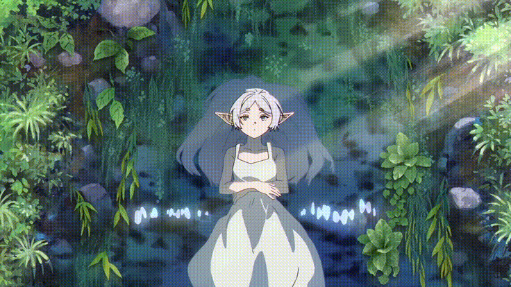

  

#

Me chamo Lucas e sou estudante do 2º ano do curso Técnico em Informática.

Sou apaixonado por tecnologia e gosto principalmente de desenvolvimento web, hardware e criação de projetos digitais. Estou sempre buscando aprender novas tecnologias, desenvolver novas ideias e transformar problemas do cotidiano em soluções através da programação.
 
#

<h3 align="left">Connect with me!</h3>

<h3 align="left">My Stack ~</h3>

 
 

<h3 align="left">GitHub Stats</h3>

  

<picture align="center">
  <source media="(prefers-color-scheme: dark)" srcset="https://raw.githubusercontent.com/paulopontodev/paulopontodev/output/github-contribution-grid-snake-dark.svg">
  <source media="(prefers-color-scheme: light)" srcset="https://raw.githubusercontent.com/paulopontodev/paulopontodev/output/github-contribution-grid-snake-dark.svg">
  
</picture>
